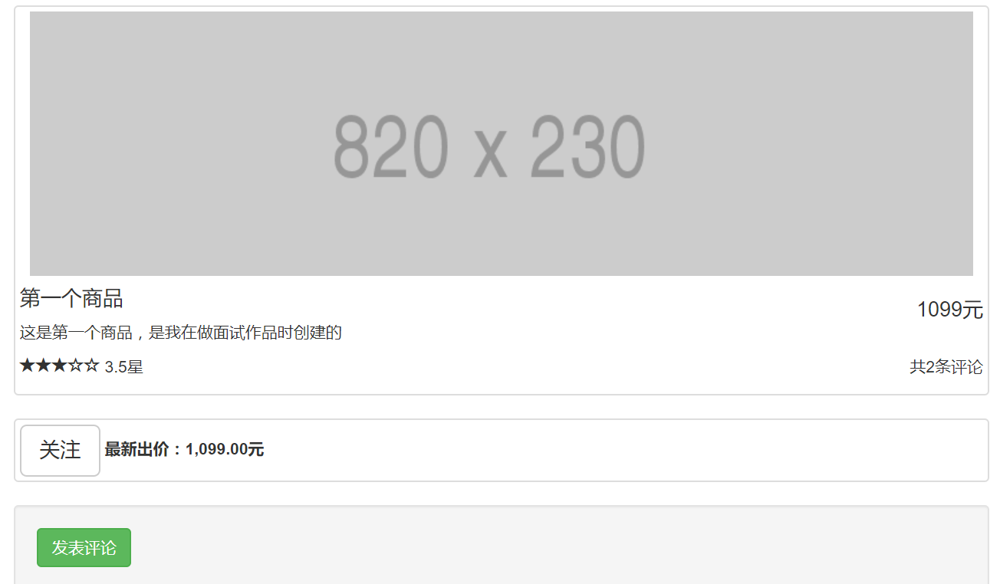

# 说明
## 文件夹
auction是作品的源代码 
server是作品部署后的文件，管理员权限运行`npm i`，然后运行`node build/auction_server.js`，打开浏览器输入：http://localhost:8000即可。

## 作品说明

>作品仿自一个竞拍网站的开源项目，运用了Angular的大部分知识。

### 具体功能
以下组件可以搜索符合条件的产品列表
    

商品详情页中，点击关注可以实时获取最新的报价，点击评论可以发表评分以及评论。

